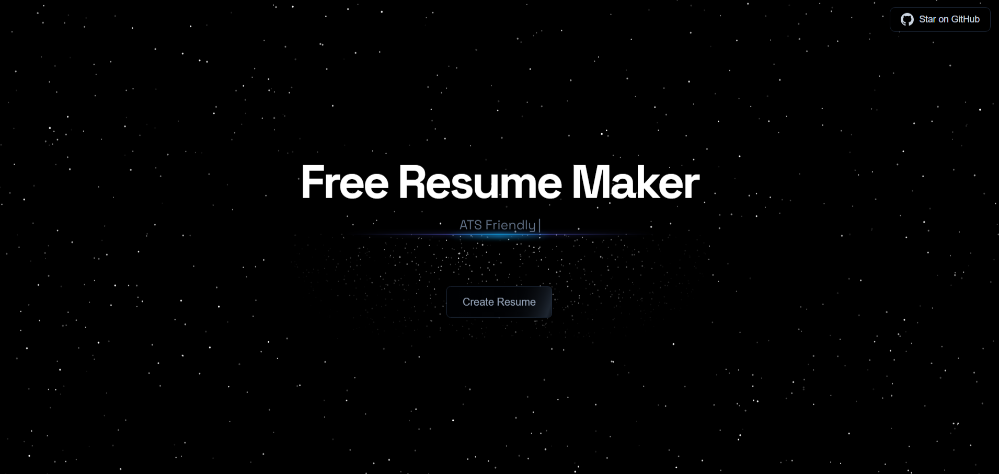
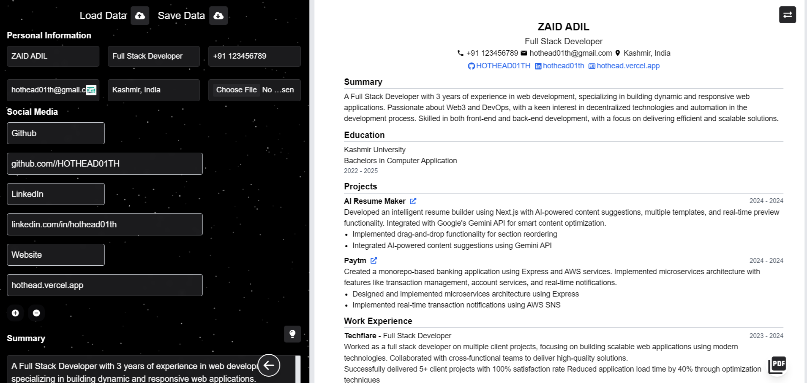

# 🚀 Free Resume Maker

### A modern, AI-powered, ATS-optimized resume builder featuring professionally designed templates and smart content suggestions.

## GitAds Sponsored
[](https://gitads.dev/v1/ad-track?source=hothead01th/free-resume-maker@github)


<p align="center">
  
  
</p>

<!-- GitAds-Verify: 3NQ7U162UFM33NVZSY8M3IPHVI14UPSE -->

## ✨ Key Features

- **AI-Powered Content Suggestions**: Smart content optimization using Google's Gemini API
- **Multiple Professional Templates**: Choose from carefully crafted, industry-standard resume layouts
- **Smart Content Enhancement**: Get real-time suggestions to improve your resume content
- **ATS-Friendly**: Engineered to pass Applicant Tracking Systems with flying colors
- **Real-time Preview**: Instant visual feedback as you build your resume
- **Drag & Drop Sections**: Easily customize section order to highlight your strengths
- **Project Links**: Showcase your work with integrated project links and icons
- **Modern UI/UX**: Clean, intuitive interface with a seamless user experience
- **Export to PDF**: One-click PDF download for your polished resume
- **Responsive Design**: Perfect resume building experience across all devices
- **Zero Cost**: Completely free and open-source

## 🛠️ Built With

- Next.js - React Framework
- Tailwind CSS - Styling
- Google Gemini API - AI Content Suggestions
- React Beautiful DnD - Drag and Drop functionality
- React Icons - Professional icons

## 📦 Installation

1. Clone the repository:
```bash
git clone https://github.com/HOTHEAD01TH/free-resume-maker.git
```

2. Navigate to the project directory:
```bash
cd free-resume-maker
```

3. Install dependencies:
```bash
npm install
```

4. Set up environment variables:
```bash
GEMINI_API_KEY=your_api_key_here
```

5. Start the development server:
```bash
npm run dev
```

6. Open your browser and navigate to `http://localhost:3000` to see the application in action.

## 📝 Usage Tips

1. **AI Suggestions**: Click the lightbulb icon to get smart content improvements
2. **Profile Section**: Start with your personal information and professional summary
3. **Experience & Projects**: Use action verbs and quantify achievements
4. **Skills & Certifications**: Include relevant technical and soft skills
5. **Project Links**: Add GitHub/live links to showcase your work
6. **Customization**: Drag and drop sections to create the perfect layout
7. **Download**: Before downloading, disable header/footer in print settings for optimal PDF output

## 🤝 Contributing

Contributions are welcome! Please feel free to submit a Pull Request.

## 📄 License

This project is licensed under the MIT License - see the [LICENSE](LICENSE) file for details

## 🙏 Acknowledgments

- Special thanks to the open-source community and [Github Projects](https://x.com/githubprojects)
- Inspired by modern recruitment needs and ATS requirements

## ⚠️ Important Note

When downloading your resume as PDF, ensure you disable header and footer in your browser's print settings for the best results.

## Star History

[](https://star-history.com/#HOTHEAD01TH/free-resume-maker&Date)

---

Made with ❤️ by Zaid for job seekers worldwide!
